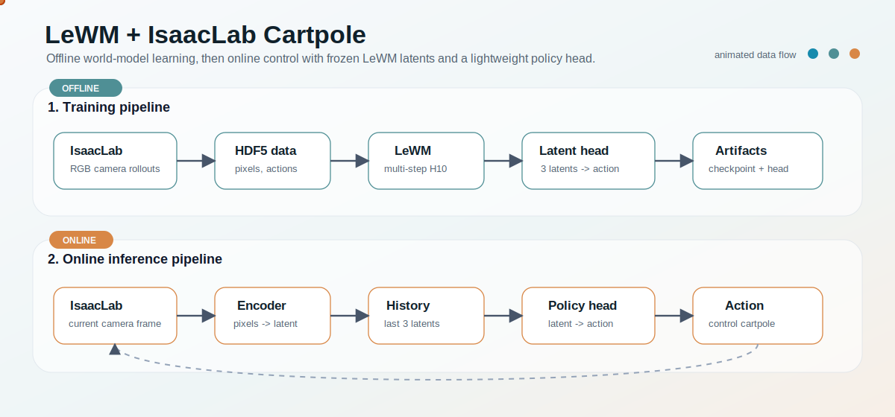
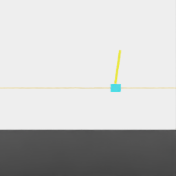
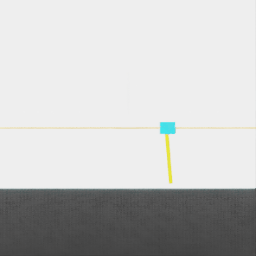

# LeWM IsaacLab Cartpole

This page records our IsaacLab Cartpole deployment built on top of LeWM. It is intentionally separate from the upstream LeWM README, because this is an applied reproduction and control experiment rather than part of the original paper documentation.

## Result Preview

The current best path is:

```text
IsaacLab RGB camera
  -> LeWM encoder
  -> last 3 latent embeddings
  -> lightweight latent policy head
  -> Cartpole action
```

PPO is only used as an offline data generator. It is not loaded during online deployment.

<p align="center">
  
</p>

<p align="center">
  
  
  
</p>

<p align="center">
  <b>Near-upright balance</b> &nbsp; | &nbsp;
  <b>Bottom swing-up</b> &nbsp; | &nbsp;
  <b>Stable control with disturbances</b>
</p>

## Best Current Metrics

```text
Near-upright deployment:
  survival_steps      300 / 300
  reward_sum          1231.06
  mean_abs_pole_angle 0.0647 rad
  mean_abs_cart_pos   0.554

Bottom deployment:
  survival_steps      300 / 300
  reward_sum          714.07
  mean_abs_pole_angle 1.094 rad
  mean_abs_cart_pos   0.494

Long disturbance deployment:
  survival_steps      1200 / 1200
  reward_sum          3647.48
  mean_abs_pole_angle 0.582 rad
  mean_abs_cart_pos   0.582
  first disturbance   recovered after 309 steps
```

## What We Keep

The recommended implementation is the latent-policy route:

```text
scripts/run_multistep_training_h10.sh
scripts/train_cartpole_latent_policy.py
scripts/isaaclab_lewm_policy_cartpole.py
scripts/lewm_isaaclab_common.py
```

The key trained artifacts are expected under:

```text
/home/hall/code/.stable-wm/checkpoints/lewm_full_angle_multistep_h10/weights_epoch_100.pt
/home/hall/code/.stable-wm/checkpoints/lewm_full_angle_latent_policy.pt
```

## Why This Route

We tried several LeWM-only control variants before settling on the current method:

```text
1. LeWM + MPC with hand-written cost
2. LeWM + state probe + CEM
3. LeWM + velocity probe
4. LeWM + rollout-aware velocity probe
5. LeWM encoder + latent policy head
```

MPC and probe-based control could survive short tests, but they often drifted to the track edge, oscillated near boundaries, or failed to produce strong recovery actions after large disturbances. The latent policy head is simpler, faster, and currently gives the most stable online behavior.

The detailed exploration log is here:

```text
docs/LEWM_ISAACLAB_EXPLORATION_LOG.md
```

## Reproduction

The full reproduction guide, including dataset preparation, multi-step LeWM training, latent policy head training, and IsaacLab deployment commands, is here:

```text
docs/LEWM_ISAACLAB_REPRODUCTION.md
```

For the latest recommended deployment command, start from the section:

```text
5. 当前推荐：Latent Policy Head 部署
```
